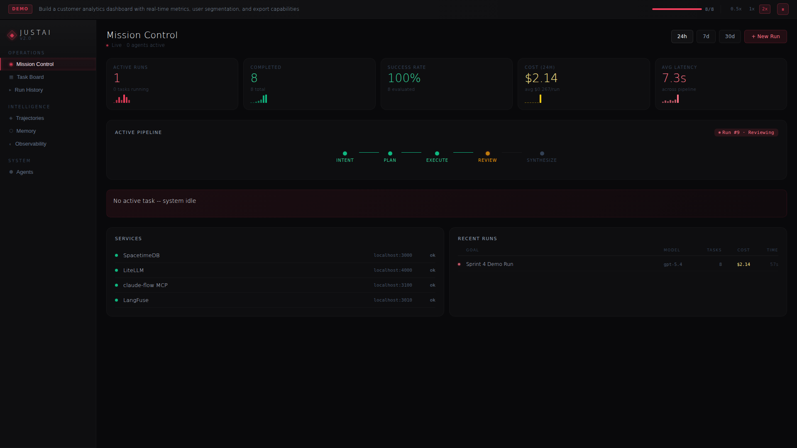
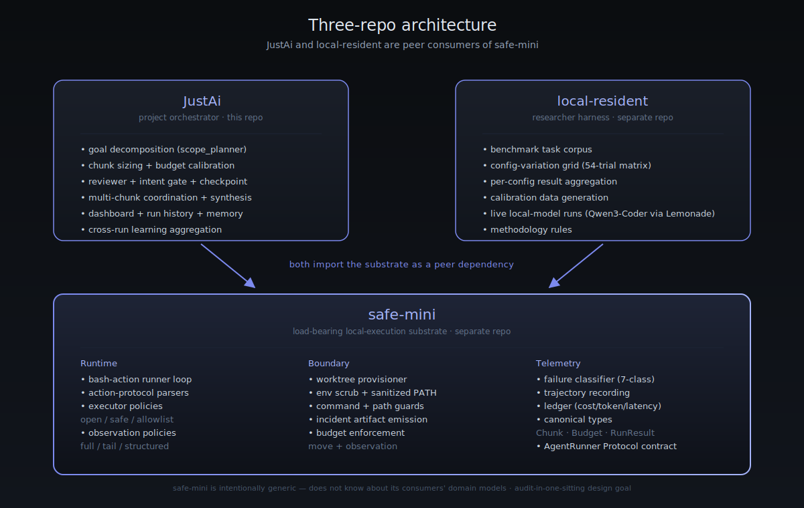
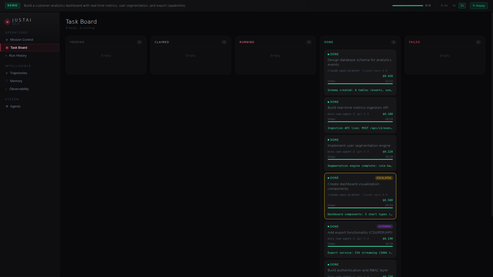
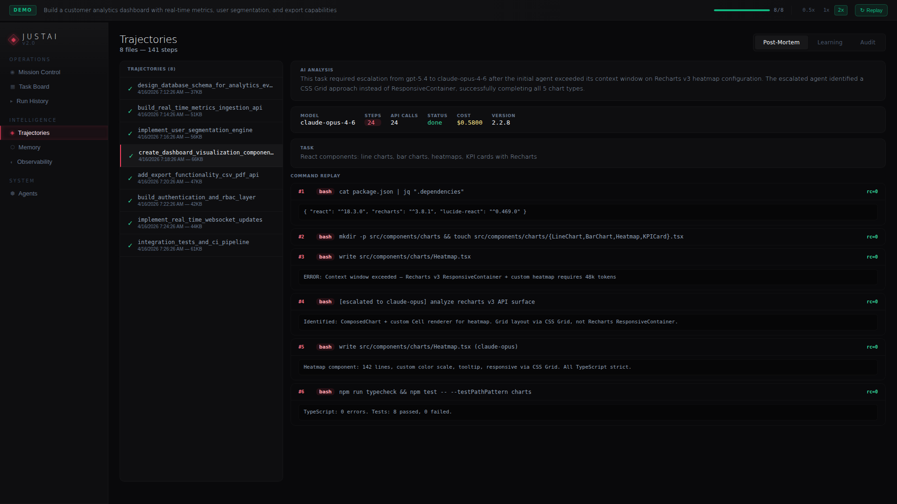
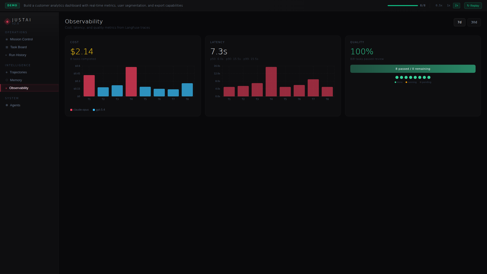
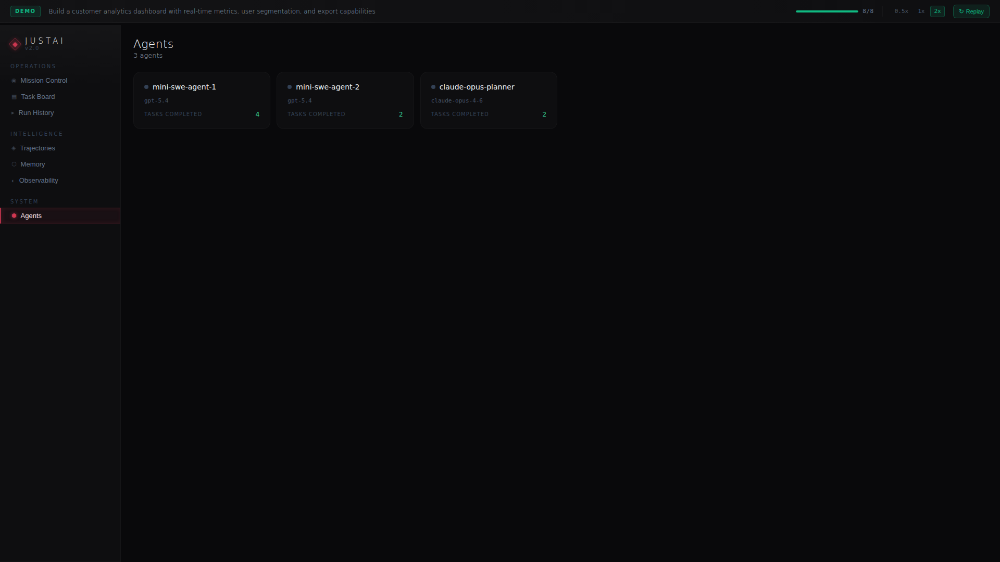
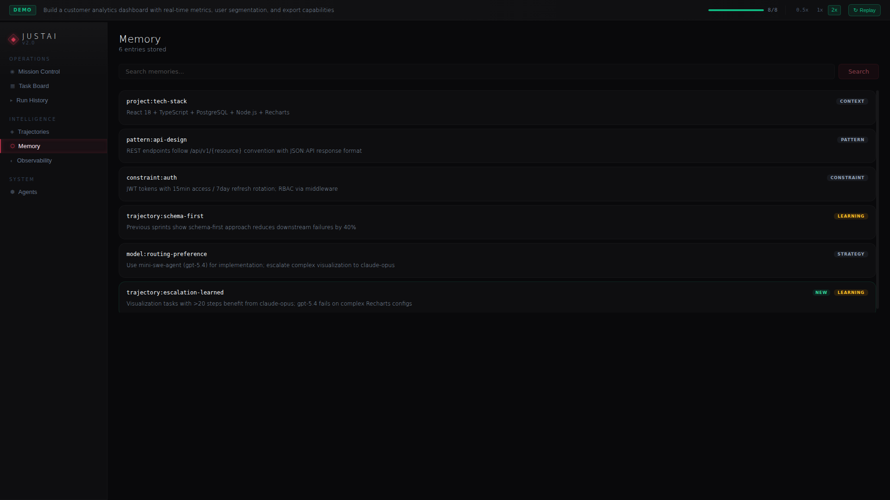

<div align="center">

# JustAi

[](LICENSE)
[](https://justai-demo.vercel.app)
[](#status)
[](#status)

**A thin project-orchestration layer over a safe-by-construction local-execution substrate for mini-swe-agent–style coding agents.**

[**🌐 Try the live demo**](https://justai-demo.vercel.app) · [**📐 The thesis**](#the-thesis) · [**🧱 Architecture**](#three-repo-architecture) · [**🗺️ Roadmap**](#roadmap) · [**📊 Status**](#status)

[](https://justai-demo.vercel.app)

</div>

---

JustAi sits between an engineering goal and the bash actions that fulfill it. It decomposes the goal into chunks sized to a budgeted bash-action loop, dispatches each chunk through a sandboxed runner, classifies failures with a structured taxonomy, and learns from every run. The substrate underneath — `safe-mini` — is what keeps that loop trustworthy on private repos: scoped worktrees, scrubbed environment, command and path guards, and an incident artifact emitted for every action.

## Why JustAi

Coding agents that decide one bash command at a time are powerful and dangerous in the same breath. A single misstep — a stray `rm -rf`, an accidental `.env` commit, a misclassified shell expansion — turns a productive run into an incident. Most current agentic frameworks address this by *limiting capability*: smaller toolboxes, narrower allowlists, more layers of approval.

JustAi takes the opposite approach.

> **Sandbox the boundary, not the capability.**
>
> Inside a properly-scoped boundary — a fresh worktree, scrubbed env, guarded path — give the agent broad capability. Outside the boundary, deny by default. Agents can solve real engineering tasks end-to-end, with leaks made structurally impossible rather than rule-checked away.

JustAi is the **orchestration UX** on top of that boundary. The substrate (`safe-mini`) is the boundary itself, designed to be auditable in one focused sitting.

### Who this is for

- Engineering teams who want autonomous coding-agent runs *on their actual private code* without unbounded blast radius.
- Researchers who want capability and safety as separable axes rather than a single dial.
- Anyone who's noticed that "make the agent more careful" doesn't scale, and is looking for a structural answer.

### What this is not

- Not a model. Bring your own LLM via LiteLLM.
- Not a benchmark harness — that's `local-resident`'s job (separate repo, post-closure).
- Not a runtime substrate by itself — the substrate is `safe-mini` (separate repo, post-closure).
- Not a finished product — currently pre-public, in stabilization. See [Status](#status).

## The thesis

[mini-swe-agent](https://github.com/SWE-agent/mini-swe-agent) decides one bash command at a time within a budget — about a hundred lines of agent loop. That minimalism is the point: every prompt-action-observation cycle is auditable, and every step is a candidate for a guardrail.

The bet underneath JustAi: capability and safety should compose, not trade off. A capable agent doesn't need to be careful, if its environment makes carelessness *structurally impossible*. The substrate is where you spend the safety budget; the orchestrator is where you spend the productivity budget.

This pattern was validated across **54 controlled trials** (6 task families × 9 configs) before this release.

> **Headline finding.** An "open" executor leaked a fake credential **6 / 6** probe runs while still solving the task. The "safe" executor blocked **6 / 6** probes and still solved **6 / 6** tasks. Capability is preserved; the leak surface isn't.

Other findings: `reproduce_first` workflow averaged 2 steps vs 3 for `inspect_first`; `headtail` and structured observations beat pure `tail` on noisy output (tail dropped early failure clues); JSON and fenced-bash action protocols were equivalent in deterministic tests, with malformed-action rate the open question for live-model evaluation.

## What the orchestrator does

`justai/` — the orchestrator (this is what JustAi ships).

| Module | Role |
|---|---|
| `scope_planner.py` | Decomposes a goal into chunks fitted to a bash-move budget. Chunks track move budget AND observation budget. |
| `intent_gate.py` | Classifies the goal type before any execution — execution / multi-step / research / ambiguous. |
| `reviewer.py` | Pre-dispatch quality gate — catches ambiguous descriptions and missing success criteria. |
| `checkpoint.py` | Risk-level approval (R0 auto through R3 manual). |
| `agent_dispatch.py` | Runs each chunk through the substrate runner. |
| `runner_protocol.py` | Local stub of the AgentRunner Protocol — moves to `safe-mini` once that repo is stood up. |
| `trajectory.py` + `memory.py` | Per-step record of every run: action, file touched, observation, outcome. Vector-indexed, queryable across runs and projects. |
| `dashboard/` | Mission Control · Task Board · Trajectories · Memory · Agents · Observability. |

What does **not** ship here, by design:

- Runner, observation policies, executor policies, failure classifier, worktree provisioner — those live in `safe-mini` (substrate, separate repo).
- Benchmark task corpus and experiment-driver harness — those live in `local-resident` (researcher repo, separate).

## Three-repo architecture

JustAi is one of three repos that share a substrate.



Both consumers depend on `safe-mini` as a peer. `safe-mini` does not know about its consumers' domain models — it's intentionally generic, so future projects can ship on top of the same substrate.

### The substrate's failure taxonomy

| Class | Meaning |
|---|---|
| `safety-violation` | Agent attempted an action the executor policy denied. |
| `action-protocol-violation` | Output didn't parse as a valid action. |
| `exhausted-ideas` | Budget remained but loop converged without progress. |
| `budget-exhausted` | Move or observation budget hit the cap. |
| `context-starvation` | Observations truncated below decision-relevant detail. |
| `reward-hacking` | Test passed by means unrelated to the requested change. |
| `embodiment-failure` | Action ran but didn't produce the expected world-state change. |

Failure-classified runs feed back into the planner: chunks that hit `context-starvation` get larger observation budgets next time; chunks that hit `safety-violation` get re-decomposed around the boundary that tripped.

## The dashboard

[](https://justai-demo.vercel.app)

The interactive demo at [justai-demo.vercel.app](https://justai-demo.vercel.app) runs a full simulated sprint — eight tasks, three agents, real-time dashboard updates — entirely in the browser. No backend dependencies. The simulation drives the same UI components the real orchestrator uses; it's a fair preview of the production experience.

### Mission Control
Active runs, per-model cost, stage latency, sprint timeline at a glance.


### Task Board
Kanban with attempt count, retry, duration, and escalation history per task.



### Trajectories
Per-run timeline with phase markers and AI-generated post-mortem analysis.



### Observability
Cost-vs-quality scatter, p50/p90/p99 latency by stage, token usage trends.



### Agents and Memory
Agent-pool status with current assignments; searchable trajectory + run-result corpus.

<table><tr><td>



</td><td>



</td></tr></table>

Sprint controls live in the top bar: pause, replay, speed multiplier. The simulation is deterministic at a given speed — replay produces identical trajectories.

## Roadmap

```
✓  Phase 1–3                                    closed
✓  Phase 4 A–F      control-plane reframe       2026-04-29
✓  Phase 4 G+H      ruff/mypy/test cleanup      2026-04-30
✓  Phase 5          ratification                2026-04-30
✓  Phase 6          closure + v0.4.0 tag        2026-04-30
↻  Public-flip gate historical-secret rotation  pending
□  safe-mini repo   stand up substrate          next
□  local-resident   stand up experiment driver  next
□  v1.0 public      release after substrate     post-stand-up
```

The post-Phase-6 work splits in two directions. **Substrate**: the canonical types and AgentRunner Protocol currently stubbed in `justai/runner_protocol.py` move to a new `safe-mini` repo, which becomes a pip-installable peer dependency. **Experiment driver**: the 54-trial calibration matrix moves to `local-resident`, alongside live local-model runs against the substrate.

## Status

Engineering surface is being prepared for public release. The repo is private during stabilization; the live demo (above) is the public-facing artifact, alongside this landing page.

| Phase | Scope | Status |
|---|---|---|
| 1–3 | original architecture | closed |
| 4 | control-plane reframe + cleanup | landed `v0.4.0` |
| 5 | ratification | clean |
| 6 | closure | tagged |

**Verification at closure:** 370 pytest passes (+14 subtests), ruff clean, mypy clean, gitleaks clean (with narrow historical allowlist), pip-audit clean, npm-audit clean, clean-venv install passes, dashboard build + smoke pass, 3-repo plan consistent.

Once post-closure polish and the historical-secret rotation gate complete, `safe-mini` and `local-resident` will be stood up as their own public repos and a `v1.0.0` release will follow.

## Built by

[**Justin Leopard**](https://github.com/JustinJLeopard) at [**Delegate & Orchestrate**](https://delegateandorchestrate.com).

Building autonomous AI systems that orchestrate, learn, and ship.

For research and collaboration inquiries: [open an issue](https://github.com/JustinJLeopard/justai-demo/issues/new), or contact via the website.

If this resonates and you want to follow along — ⭐ this repo (or [watch](https://github.com/JustinJLeopard/justai-demo/subscription) for the public-flip notification).

## License

MIT — see [LICENSE](./LICENSE).

---

<sub>Last updated 2026-04-30 (post-Phase-6 closure, `v0.4.0`). Engineering source remains private during stabilization.</sub>
