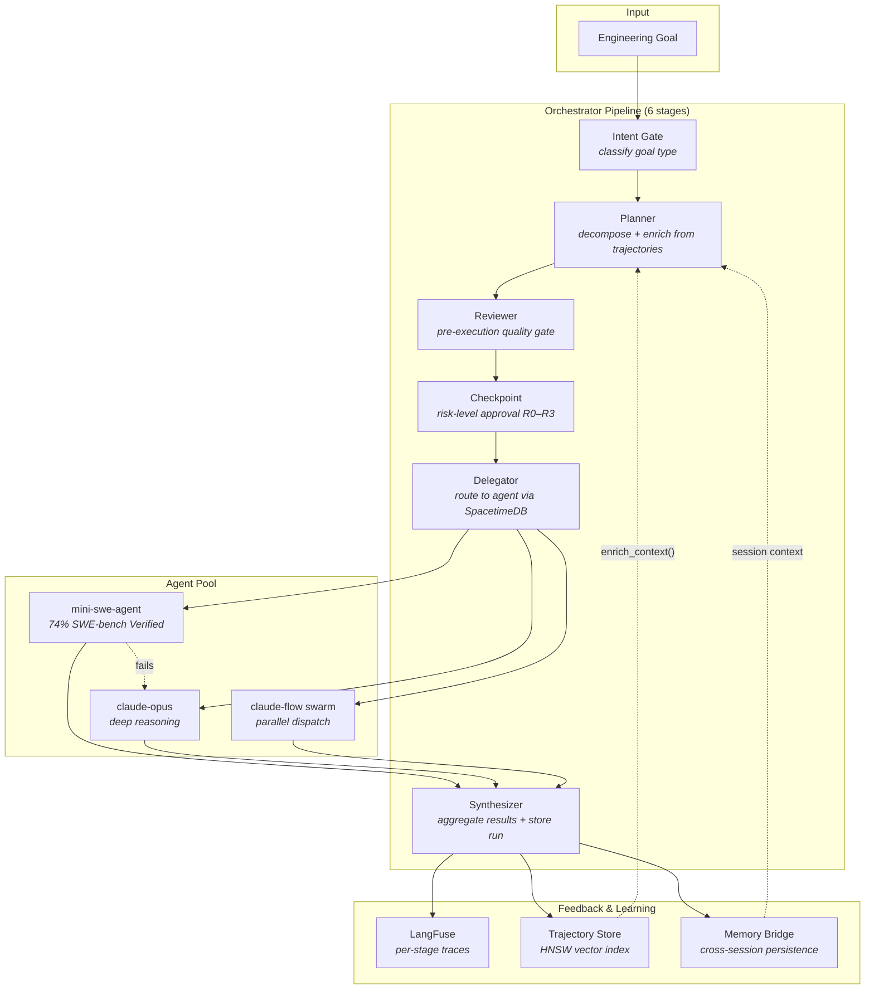

# JustAi

**Autonomous orchestration, adaptive memory, and trajectory intelligence for AI coding agents.**

JustAi is a multi-agent orchestration system that decomposes high-level engineering goals into task plans, delegates execution across heterogeneous model backends, reviews output against acceptance criteria, and improves over time through trajectory-based learning. It integrates enterprise-grade observability (LangFuse), real-time coordination (SpacetimeDB), and persistent vector memory (HNSW) into a unified pipeline that treats every agent run as training data for the next.

Built on the [rUv agentic framework](https://github.com/ruvnet) — an open-source ecosystem for multi-agent swarm orchestration, self-adaptive feedback loops, and autonomous workflow coordination.

[**Try the Live Demo**](https://delegateandorchestrate.com/demo/justai) | [**delegateandorchestrate.com**](https://delegateandorchestrate.com)

---

## System Architecture



A goal enters the system. The **Intent Gate** classifies it (execution, multi-step, research, or ambiguous). The **Planner** decomposes it into mini-sized tasks, enriched with similar past trajectories retrieved via HNSW approximate nearest-neighbor search (similarity threshold ≥ 0.6). The **Reviewer** validates plan quality before execution — a pre-flight gate that catches ambiguous descriptions, missing success criteria, and incorrect dependency ordering. The **Checkpoint** enforces risk-level approval (R0 auto-approve through R3 manual-only). The **Delegator** posts tasks to SpacetimeDB, where agents claim and execute them. The **Synthesizer** aggregates results, stores the run in persistent memory, and records the trajectory for future learning.

If a task fails, the **Escalation Engine** re-routes it to a stronger model automatically. Failure reasons are persisted in memory so future routing decisions can avoid known-bad assignments.

---

## Key Capabilities

### Multi-Model Orchestration

Real-time visibility into the full orchestration pipeline — from intent classification through agent execution to review. Mission Control displays active runs, per-model cost, stage latency, and the 6-stage pipeline state at a glance.


### Adaptive Task Routing & Escalation

Every task starts with the cheapest capable model. When mini-swe-agent (74% SWE-bench Verified — the highest-performing open-source coding agent) cannot complete a task, JustAi automatically escalates to claude-opus for deeper reasoning. The Task Board provides a 5-column Kanban view (pending → claimed → in_progress → done → archived) with per-task metadata: attempt number, retry count, duration, and execution result.


### Trajectory Intelligence & Cross-Project Learning

Every agent run produces a structured trajectory — a step-by-step record of actions taken, tools invoked, files modified, and outcomes observed. JustAi's trajectory system operates in three modes:

- **Post-mortem analysis** — AI-powered root cause identification. Each trajectory (up to 40 steps, condensed to 150-char summaries) is sent to an LLM for structured analysis: summary, root cause, divergence step, recommendation, and file-change manifest.
- **Pattern extraction** — Aggregate statistics across trajectories: success rate, average step count, average cost, common failure reasons keyed by action type and command prefix, and efficiency trends over time.
- **Context enrichment** — Before planning new tasks, the system searches the trajectory store for semantically similar past runs (HNSW vector search, cosine similarity ≥ 0.6). Matched trajectories are formatted as structured context injected into the planner prompt, allowing the system to learn from both successes and failures.

This implements a form of **experience replay** — a technique from reinforcement learning where past experiences are stored and selectively re-used to accelerate learning. Unlike traditional RL, JustAi uses semantic similarity rather than random sampling, ensuring the most relevant experiences inform each new planning cycle.


**How trajectories compound over time:** Each completed run adds to the trajectory store. As the corpus grows, the planner receives increasingly relevant context for new goals — patterns that worked, failure modes to avoid, and efficient step sequences for similar tasks. This creates a positive feedback loop: more runs → richer trajectory corpus → better plans → higher success rates → more valuable trajectories. Across projects sharing the same memory backend, trajectories from one codebase inform planning in another, enabling genuine cross-project transfer learning.

### Enterprise Observability via LangFuse

JustAi integrates [LangFuse](https://langfuse.com) — the open-source LLM observability platform — at every stage of the orchestrator pipeline. This is not surface-level logging; each pipeline stage (intent gate, planner, reviewer, executor, delegator, synthesizer) wraps its LLM calls in a `trace_generation()` context manager that captures:

| Metric | Granularity | Method |
|--------|-------------|--------|
| **Cost** | Per-call, per-stage, per-model, daily aggregates, running totals | Stacked bar charts with model breakdown |
| **Latency** | p50 / p90 / p99 percentiles, per-stage breakdown, bottleneck identification | Time-series with percentile bands |
| **Token usage** | Input/output counts per trace, daily aggregates | Cumulative tracking |
| **Quality** | Success/failure rates, first-try vs. retry tracking, failure category histograms | Cost-vs-quality scatter plots |
| **AI insights** | Heuristic analysis of first-try rates, failure patterns, cost-quality correlation | Auto-generated narrative |

When LangFuse keys are configured (`LANGFUSE_PUBLIC_KEY`, `LANGFUSE_SECRET_KEY`), every orchestrator invocation emits full traces. When keys are absent, all tracing functions are no-ops — zero overhead, no code changes required. The `get_aggregated_metrics()` function computes 7-day rolling windows across up to 500 recent traces, producing the data structures that drive the Observability dashboard.


This level of per-stage, per-model instrumentation is typically found in enterprise MLOps platforms. JustAi brings it to autonomous coding agents — making cost optimization, latency profiling, and quality regression detection first-class concerns rather than afterthoughts.

### SpacetimeDB: Real-Time Coordination with Full Audit Trail

JustAi uses [SpacetimeDB](https://spacetimedb.com) as its coordination backbone — a relational database with built-in WebSocket subscriptions that combines the consistency guarantees of SQL with the reactivity of a real-time event bus.

**Why SpacetimeDB instead of A2A (Agent-to-Agent) protocols:**

Traditional A2A communication (direct agent-to-agent messaging) is fire-and-forget: once a message is sent, there is no durable record, no queryable state, and no way to recover coordination state after a crash. SpacetimeDB inverts this model. Every task state transition (pending → claimed → in_progress → done) is a database write with a timestamp. The coordination layer *is* the audit trail. This means:

- **Persistence is free** — every task claim, heartbeat, and status change is already stored in a relational schema. There is no separate logging step.
- **Recovery is trivial** — after a crash, agents reconnect and query current state. There is no message replay, no consensus protocol, no reconciliation phase.
- **Observability is built-in** — the dashboard queries the same tables agents write to. Real-time visibility requires zero additional infrastructure.
- **Consistency over speed is the right trade-off** — for autonomous coding agents where a single task may run for 30 minutes, the coordination overhead of a database write (sub-millisecond for SpacetimeDB's in-process SQLite) is negligible compared to task execution time.

The SpacetimeDB client (`spacetime.ts`) implements dual-transport connectivity:
- **Primary:** WebSocket subscription for real-time `TransactionUpdate` push notifications
- **Fallback:** HTTP polling via SQL queries (3-second intervals) with exponential backoff reconnection (1s → 2s → 4s → 8s → 16s → 30s max)

Agent liveness is monitored via heartbeat timestamps with a 90-second staleness threshold. The dashboard renders transport status (WebSocket / polling / disconnected) in the sidebar so operators always know the data freshness.

### Persistent Memory with Vector Search

Cross-session memory backed by a hybrid storage engine: sql.js for structured data and HNSW (Hierarchical Navigable Small World graphs) for 384-dimensional vector similarity search. The Memory Bridge communicates via JSON-RPC 2.0 over HTTP to the [claude-flow](https://github.com/ruvnet/ruflo) MCP server — a direct HTTP path that benchmarks at ~5ms per operation, 40x faster than the CLI subprocess fallback (~200ms+).

Memory is organized by namespace (`justai` for general entries, `justai-trajectories` for trajectory outcomes) and supports:
- **Exact key retrieval** — O(1) lookup for known entries
- **Semantic search** — HNSW approximate nearest-neighbor queries over auto-generated embeddings
- **Cross-session persistence** — session context stored at pipeline start, restored at next invocation
- **Run history** — every completed run stored with structured metadata (goal, intent, task count, success/failure counts, duration)


### Agent Registry & Swarm Coordination

Live visibility into the agent pool. The registry combines SpacetimeDB agent table data with claude-flow MCP swarm status, showing agent roles, online/offline/stale status, current task assignments, and swarm topology (mesh, hierarchical, ring, or star configurations).


---

## Underlying Frameworks

JustAi is built on and extends several open-source frameworks from the [rUv agentic ecosystem](https://github.com/ruvnet):

| Framework | Role in JustAi | Description |
|-----------|---------------|-------------|
| [**RuFlo / claude-flow**](https://github.com/ruvnet/ruflo) | Memory backend, swarm dispatch, 264 MCP tools | Multi-agent orchestration platform. Deploys specialized agent roles in coordinated swarms with configurable topologies, fault-tolerant consensus protocols, and a self-learning feedback loop architecture. Provides the JSON-RPC 2.0 MCP server that JustAi's memory bridge and swarm delegator connect to. |
| [**SAFLA**](https://github.com/ruvnet/SAFLA) | Persistent memory, safety validation | Self-Adaptive Feedback Loop Algorithm. Hybrid memory system (vector, episodic, semantic, working memory with attention mechanisms) designed for autonomous AI agents. Provides the constraint engine and risk assessment framework that informs JustAi's R0–R3 checkpoint gates. |
| [**agentic-flow**](https://github.com/ruvnet/agentic-flow) | Self-learning hooks, model routing | Production-ready agent orchestration with self-learning hooks that improve agent routing decisions over time. Provides `hooks pretrain` to bootstrap routing intelligence from codebase analysis. |
| [**SPARC**](https://github.com/ruvnet/sparc) | Planning methodology | Structured development methodology — Specification, Pseudocode, Architecture, Refinement, Completion. Provides the planning templates that JustAi's planner uses to decompose goals into well-scoped, testable tasks. |
| [**FACT**](https://github.com/ruvnet/FACT) | Cache-first retrieval | Fast Augmented Context Tools. A retrieval pattern that replaces vector-based RAG with prompt caching + deterministic MCP tool execution, achieving sub-100ms latency and 60–90% cost reduction versus traditional RAG. |

---

## Technical Stack

| Layer | Technology | Details |
|-------|-----------|---------|
| Orchestrator | Python 3 | 6-stage pipeline: intent gate, planner, reviewer, checkpoint, delegator, synthesizer |
| Agent Runtime | mini-swe-agent, claude-opus | SWE-bench Verified leader + deep reasoning fallback |
| Dashboard | React 18 + TypeScript + Tailwind + Recharts | 7 views: Mission Control, Task Board, Trajectories, Observability, Memory, Run History, Agents |
| Real-time Data | SpacetimeDB | WebSocket subscriptions + HTTP SQL fallback, dual-transport with auto-reconnection |
| Model Routing | LiteLLM | Multi-provider proxy (GPT-5.4, Claude Opus, Codex) on localhost:4000 |
| Observability | LangFuse | Per-stage tracing with cost/latency/quality aggregation, p50/p90/p99 percentiles |
| Memory | claude-flow MCP + HNSW | 384-dim vector embeddings, ~5ms operations via JSON-RPC 2.0 |
| Coordination | SpacetimeDB relay-room | Task lifecycle tracking, agent heartbeats, event log |
| Test Suite | pytest | 479 tests across 12 sprint cycles, all offline (mocked external calls) |

---

## Pipeline Detail

```
Engineering Goal
  │
  ├─ [1/6] Intent Gate ─── classify: EXECUTION | MULTI_STEP | RESEARCH | AMBIGUOUS
  │                         confidence score (0.0–1.0), heuristic fallback on LLM failure
  │
  ├─ [2/6] Planner ──────── decompose into mini-sized tasks (≤35 agent steps each)
  │                         each task: title, description, agent type, risk level (R0–R3),
  │                         bash-verifiable success criteria, dependency ordering
  │                         enriched with trajectory context from similar past runs
  │
  ├─ [3/6] Reviewer ─────── pre-execution quality gate
  │                         validates: sizing, ambiguity, dependency sequence, criteria
  │                         replan loop: up to 2 attempts before blocking
  │
  ├─ [4/6] Checkpoint ───── risk-level approval
  │                         R0: auto-approve │ R1: notify, 60s auto-proceed
  │                         R2: hard gate    │ R3: manual unlock only
  │
  ├─ [5/6] Delegator ────── post tasks to SpacetimeDB, agents claim and execute
  │                         5s polling, 120s claim timeout, 1800s execution timeout
  │                         up to 2 retries on failure, escalation to stronger model
  │
  └─ [6/6] Synthesizer ──── aggregate results, store run in memory, record trajectory
                            status: complete (0 failures) | partial | failed
```

### Escalation Strategy

1. Every task starts with mini-swe-agent (cheapest, fastest)
2. On failure, the task is automatically escalated to claude-opus
3. The failure reason is recorded in memory for future routing optimization
4. The swarm delegator (`swarm_delegator.py`) supports parallel dispatch for scale testing

---

## Live Demo

Experience JustAi orchestrating a full sprint — 8 tasks, 3 agents, real-time dashboard updates:

**[delegateandorchestrate.com/demo/justai](https://delegateandorchestrate.com/demo/justai)**

---

## Built By

**Justin Leopard** — [Delegate & Orchestrate](https://delegateandorchestrate.com)

Building autonomous AI systems that orchestrate, learn, and ship.

