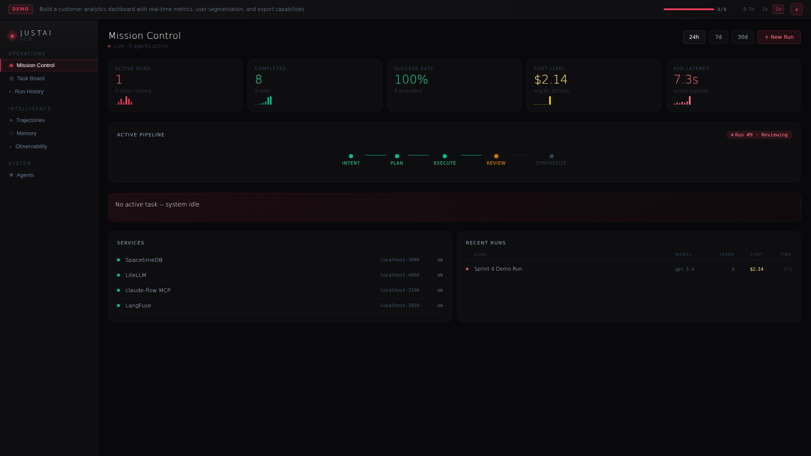
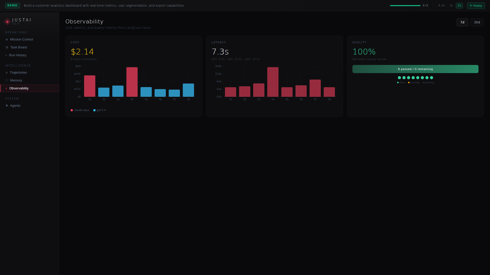
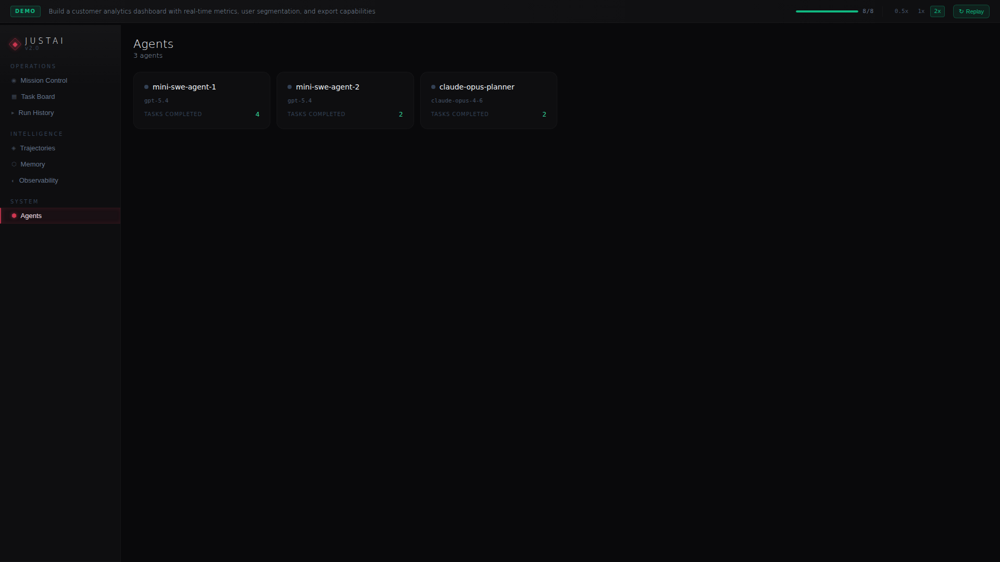
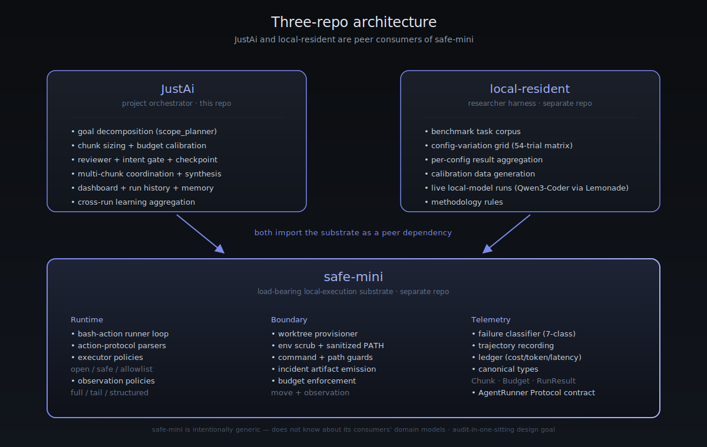

<div align="center">

# JustAi Demo

[](LICENSE)
[](https://justai-demo.vercel.app)
[](#current-status)

**A deterministic, fixture-backed browser simulation of the JustAi orchestration interface.**

[**Explore the simulation**](https://justai-demo.vercel.app) · [**Interface tour**](#interface-tour) · [**Project boundaries**](#project-boundaries) · [**Status**](#current-status)

[](https://justai-demo.vercel.app)

</div>

---

This repository packages a static UI walkthrough. A scripted eight-task scenario
advances through planning, task assignment, review, and synthesis entirely in the
browser. The displayed agents, costs, latencies, trajectories, memory entries,
and task results all come from bundled fixture data.

There is no backend connection, no live agent or model activity, and no shell or
repository execution. Replaying the scenario resets the same deterministic
in-browser state; it does not start a productive coding run or mutate a project.

## What to inspect

The demo is useful for evaluating:

- how a future orchestration control plane could present task state, checkpoints,
  escalation, and run evidence;
- the information hierarchy across Mission Control, Task Board, Trajectories,
  Memory, Agents, and Observability;
- deterministic UI transitions, replay controls, and dense operational views.

It is not evidence of end-to-end coding execution, sandbox isolation, private-repo
safety, live-model performance, or production readiness.

## Interface tour

### Mission Control

Scripted sprint progress, fixture-derived model costs, stage latency, and timeline
events at a glance.


### Task Board

A Kanban view of scripted task states, attempts, durations, and escalation history.


### Trajectories

Fixture timelines, phase markers, commands, observations, and post-mortem copy.
These are presentation examples, not captured transcripts from live agents.


### Observability

Cost, quality, latency, and token-use charts rendered from the scenario fixtures.



### Agents and Memory

Fixture agent assignments and example trajectory/run-result records.

<table><tr><td>



</td><td>


</td></tr></table>

The top bar provides pause, replay, and speed controls. At a given speed, replay
produces the same scripted trajectory.

## Project boundaries

The diagram below shows the intended separation of responsibilities. It is a
conceptual architecture, not a claim that this demo wires the projects together.



- [`JustAi`](https://github.com/JustinJLeopard/JustAi) is the public planning,
  review, and checkpoint control-plane prototype. Its public execution path is
  currently unwired and fails closed.
- [`safe-mini`](https://github.com/JustinJLeopard/safe-mini) is a separate alpha
  runner and policy library. Its built-in executors run in the host process;
  isolation requires a caller-supplied executor boundary.
- `local-resident` is the separate experiment/calibration project.
- This repository is the static browser simulation. It does not import or invoke
  those runtime projects.

The interface could later become a viewer for immutable, backend-produced run
receipts. That integration is future work, not current behavior.

## Run locally

The checked-in site is prebuilt and has no package dependencies:

```bash
git clone https://github.com/JustinJLeopard/justai-demo.git
cd justai-demo
npm run build
python3 -m http.server 8000
```

Then open `http://localhost:8000`.

`npm run build` performs a lightweight static-asset and link check. It does not
exercise a backend or validate productive agent execution.

## Current status

| Surface | Current truth |
|---|---|
| Browser interface | Public deterministic simulation |
| Scenario data | Bundled fixtures |
| Backend connection | None |
| Live agents or model calls | None |
| Shell execution or repository mutation | None |
| Productive coding evidence | Not provided by this repository |

## Built by

[**Justin Leopard**](https://github.com/JustinJLeopard) at [**Delegate & Orchestrate**](https://delegateandorchestrate.com).

For research and collaboration inquiries, [open an issue](https://github.com/JustinJLeopard/justai-demo/issues/new).

## License

MIT — see [LICENSE](./LICENSE).
